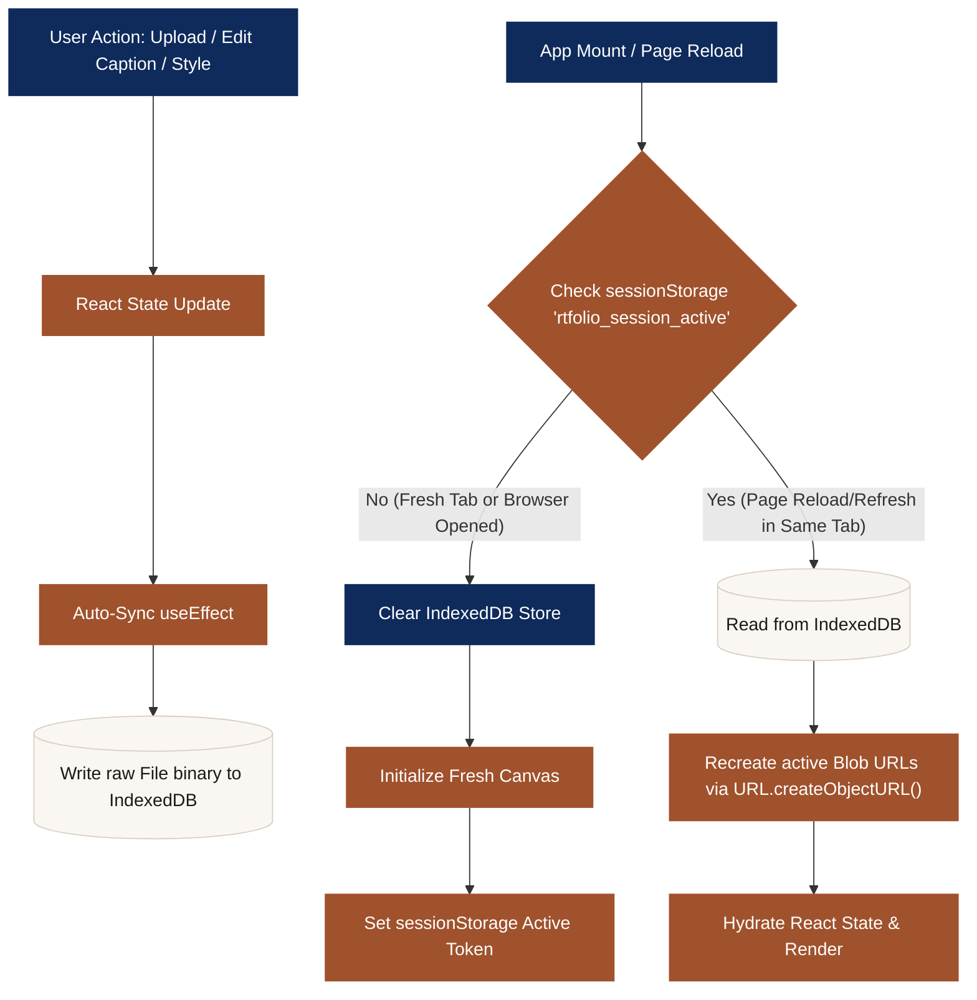

# RtFolio — Local-First Artist Portfolio Builder

RtFolio is a premium, web-based tool for artists and creators to design, style, and export structured portfolio sheets (A4 layout) completely locally.

This project uses a **local-first session architecture** that respects user privacy and data security by keeping all images, layouts, and metadata strictly in the browser. 

---

## 🏗️ Architecture & Session Persistence Flow

Because RtFolio works with large artwork images, it uses browser-native **IndexedDB** to store binary files safely, and handles session lifetime tracking via `sessionStorage`. 

The chart below shows how data is loaded, saved, and wiped automatically depending on the session state:



---

## 🛠️ Key Technical Features

### 1. Zero Cloud Databases or Backends
RtFolio does not send image uploads or text to any server. All processing is run client-side in your browser.

### 2. High-Capacity Binary Persistence
Instead of `localStorage` (which is limited to 5MB and only supports strings), we use **IndexedDB** ([db.ts](file:///d:/project/art/artwork/src/lib/db.ts)). IndexedDB allows storing native `File` objects and `Blob` binaries directly in a sandboxed space with storage caps of hundreds of megabytes.

### 3. Session-Lifetime Lifecycle (`sessionStorage`)
To ensure your workspace is private and temporary (not saved forever), we utilize `sessionStorage` as a session marker:
* **Survives refreshes**: Refreshing/reloading the page retains all your images and captions.
* **Auto-deleted on exit**: Closing the browser tab or closing the browser window completely invalidates the session. The next time you open the app, all previous local files and captions are deleted automatically from IndexedDB.

### 4. Interactive A4 Editor & PDF Export
* The center pane displays a live, interactive 794px-wide canvas representing an A4 sheet.
* Edit text fields inline with direct `contentEditable` sync.
* PDF exports compile custom styling, grids, and caption layouts into printable documents entirely offline using `html2canvas` and `jsPDF`.

---

## 🚀 Getting Started

### Development
To run RtFolio locally in development mode:

1. Install dependencies:
   ```bash
   npm install
   ```
2. Launch the Vite dev server:
   ```bash
   npm run dev
   ```
3. Open `http://localhost:5173` in your browser.
